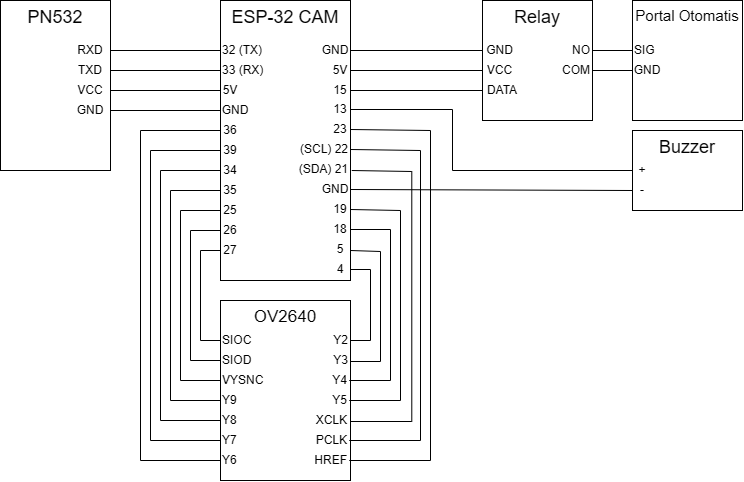

# ESP32 RFID and QR Reader
ESP32-CAM RFID reader using PN532 (HSU) and QR Reader using OV2640
# Description
This project utilize PN532 using HSU interface to communicate with ESP32 and OV2640 to detect and decode QR code using quirc library. This repository contain the source code for ESP32 and meant to be connected to a Raspberry Pi or a central server for RFID and QR code database.
# Circuit
Used Freenove Wrover

